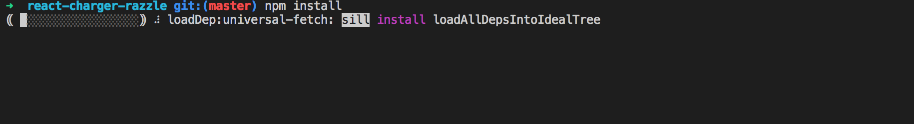

# Começando com React Charger

### Como baixar ?

* Primeiramente acesse o link: [**https://github.com/omariosouto/react-charger-razzle**](https://github.com/omariosouto/react-charger-razzle)
* Em seguida faça download do projeto baixando um zip ou usando o comando : `git clone git@github.com:omariosouto/react-charger-razzle.git` 

* Após ter baixado, acesse a pasta de onde esta o projeto \(extraia o zip caso necessário\) e dentro da pasta rode o comando: `npm install` para instalar as dependências do projeto

* Quando as dependencias forem instaladas, rode o comando **npm run start:dev** para visualizar o projeto: 

